# 🚀 Phishing URL Detection with Multi-Model Contributions 🔍

[](https://www.python.org/)
[](https://www.tensorflow.org/)
[](https://pytorch.org/)
[](https://scikit-learn.org/)

This repository contains the complete codebase for a collaborative **Phishing URL Detection** project. The project implements and compares three distinct approaches:

- **Classic Machine Learning** (Logistic Regression, Random Forest, XGBoost, LightGBM) on hand‑crafted URL features.
- **CNN + Ensemble** (CNN feature extractor + Random Forest / XGBoost / LightGBM).
- **CNN + BiLSTM** (End‑to‑end deep learning on raw character sequences).
- **Hierarchical Multi‑View Deep Model** (Character‑level CNN + Transformer blocks + structural & feature branches with gated fusion).

All Four pipelines are integrated into a single **Chrome Extension** for real‑time phishing detection.

---

## 👥 Team Contributions

This project was developed as a collaborative effort by:

- **Mehraveh** 👩‍💻
- **Parsa** 👨‍💻
- **Arian** 👨‍💻

---

## 🏗️ Project Architecture

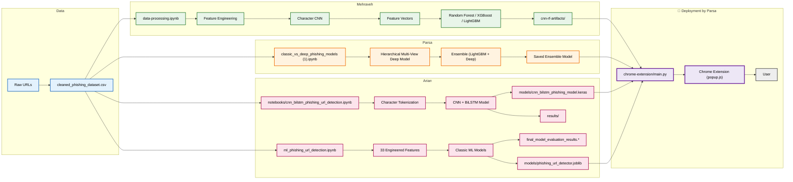

---

## 📂 Repository Structure


```
phishing-url-detection-with-contributions/
├── chrome-extension/          # (Parsa) Chrome extension for real-time detection
│   ├── main.py                # Flask backend server
│   ├── manifest.json          # Extension configuration
│   ├── popup.html              # UI layout
│   └── popup.js                # Frontend logic
│
│
├── cnn-rf-artifacts/           # (Mehraveh) Saved CNN + Ensemble artifacts
│   ├── char_cnn_final.pt       # Trained character-level CNN weights
│   ├── config.json             # Model configuration
│   ├── random_forest.zip       # Saved Random Forest ensemble model
│   └── vocab.json              # Character vocabulary mapping
│
│
├── data/                       # (Mehraveh) Dataset and preprocessing files
│   ├── cleaned_phishing_dataset.csv
│   ├── cleaned_phishing_dataset_with_features.zip
│   └── README.md               # README for using the data
│
│
├── models/                     # Saved production models
│   ├── cnn_bilstm_phishing_model.keras  # (Arian) CNN-BiLSTM deep learning model
│   └── phishing_url_detector.joblib     # (Parsa) Machine learning detector
│
├── notebooks/                  # (Arian) Deep learning experiments
│   ├── cnn_bilstm_phishing_url_detection.ipynb
│   ├── ml_phishing_url_detection.ipynb
│   ├── cnn-rf-final.ipynb      # (Mehraveh) CNN + Ensemble training pipeline
│   ├── classic_vs_deep_phishing_models (1).ipynb  # (Parsa) Classic ML + deep model + ensemble experiments 
│   └── data-processing.ipynb   # (Mehraveh) Data cleaning and feature engineering
│ 
├── README.md
│ 
├── requirements.txt            # Python environment dependencies
│
├── results/                    # Evaluation results and performance reports
│   ├── cnn_bilstm_phishing.weights.h5
│   ├── cnn-rf-xgb-lgbm.csv
│   ├── final_model_evaluation_results.csv
│   └── final_model_evaluation_results.xlsx
│
└── assets/                     # Diagrams, figures, and documentation assets
```
---

## 📈 Evaluation Plots

All evaluation results, including ROC-AUC curves, Precision-Recall curves, confusion matrices, learning curves, and training performance visualizations, are available in the `assets/` folder.

### Arian — CNN-BiLSTM Model and Classic ML Evaluation

#### ROC-AUC Curve

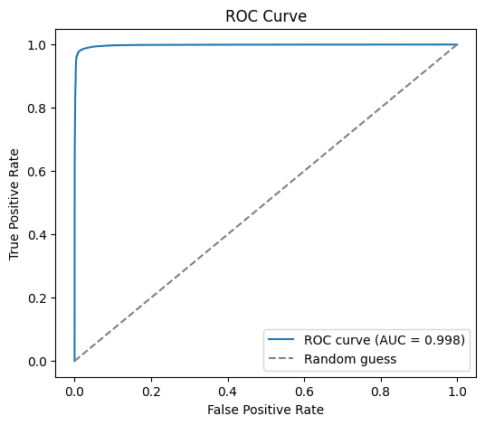

#### Precision-Recall Curve

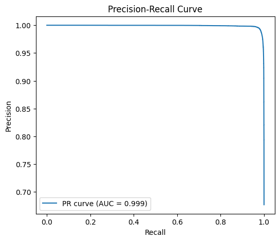

#### Confusion Matrix

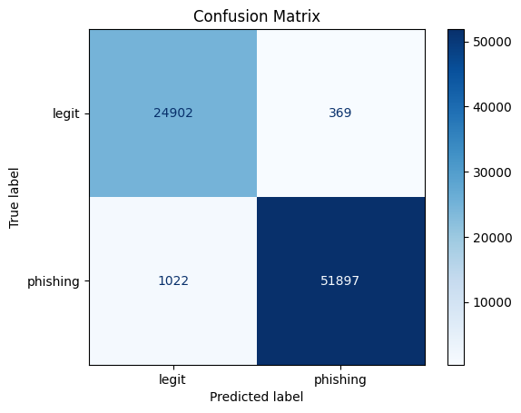

#### Training Curves

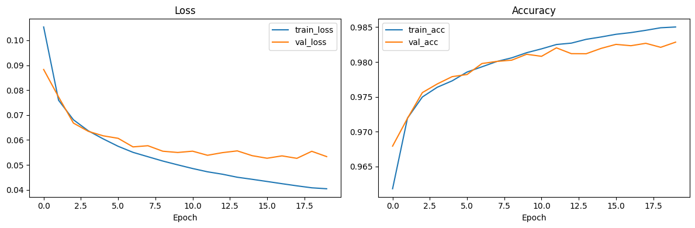

#### Best ML Model — XGBoost

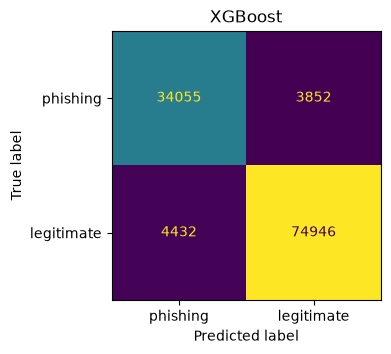


### Mehraveh — CNN + Random Forest Feature Analysis & Evaluation

#### Feature Statistics Comparison

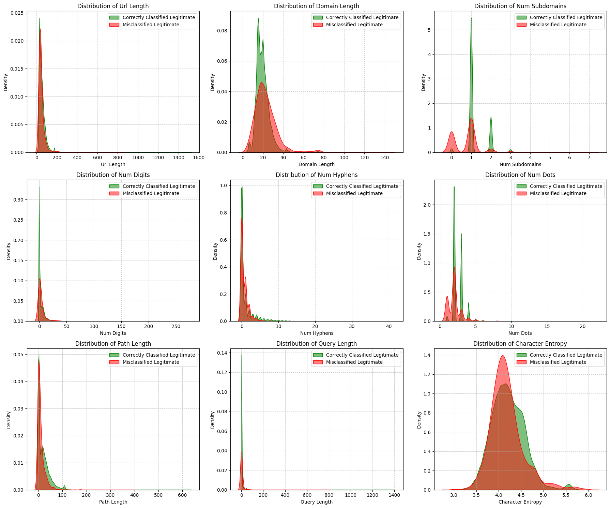

#### ROC-AUC Curve

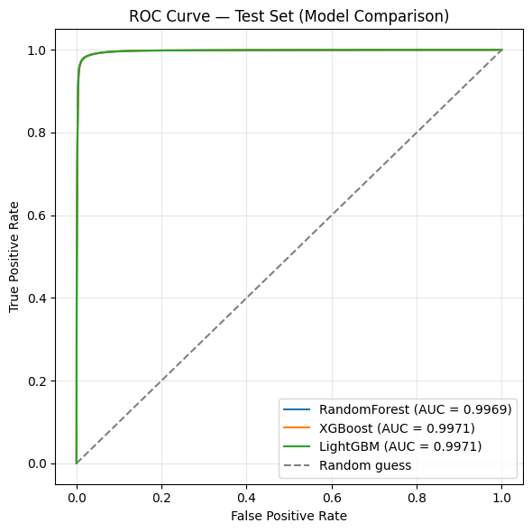

#### Precision-Recall Curve

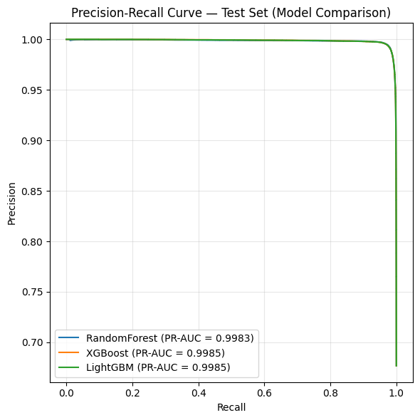

#### Confusion Matrix

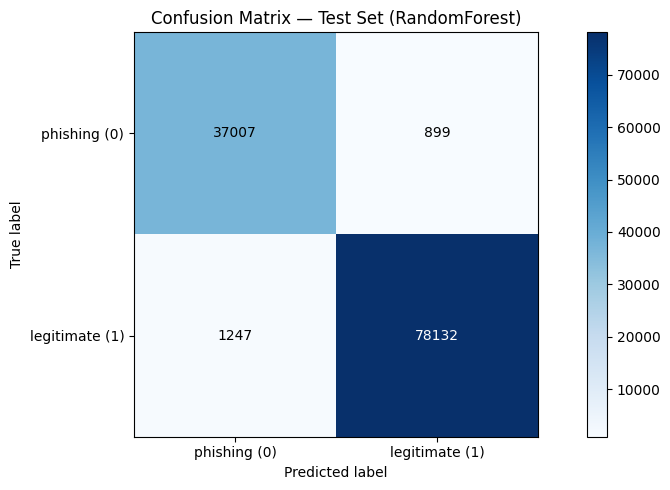


### Parsa — Hierarchical Multi‑View Deep Model Evaluation

#### ROC Curve

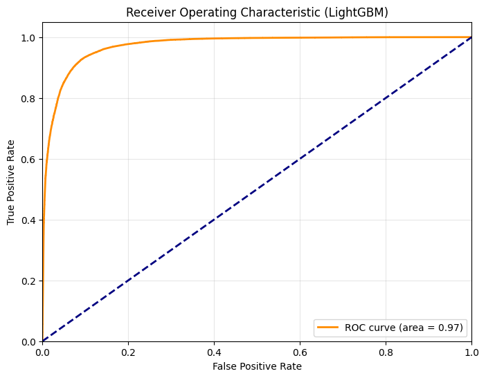

#### Learning Curve

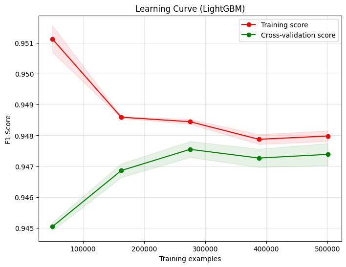

---
## 🧠 Model Comparison Chart

| Model | Developer | Accuracy | F1‑Score | ROC‑AUC | Training Time ⏱️ | Model Complexity 🧩 | 
| :--- | :--- | :--- | :--- | :--- | :--- | :--- | 
| **Classic ML (XGBoost)** | **Arian** | 92.9% | 0.944 | 0.975 | ~15 min | Medium |
| **CNN + Ensemble (RandomForest)** | **Mehraveh** | 98.17% | 0.987 | 0.997 | ~25 min (GPU) | High | 
| **CNN + BiLSTM** | **Arian** | **98.1%** | **0.987** | **0.998** | **~15 - 18 min (GPU)** | High | 
| **LightGBM (Classic Features)** | **Parsa** | 92.6% | 0.946 | 0.972 | ~30 min | Medium | 
| **Hierarchical Multi‑View Deep** | **Parsa** | ? | ? | ? | ~4 hours (GPU) | Very High |


**Key Observations:**

- **CNN + BiLSTM (Arian)** achieved the best balance between performance and efficiency, reaching **98.1% accuracy**, **0.987 F1-score**, and the highest **ROC-AUC (0.998)** while requiring only **~15–18 minutes** of training time. Its ability to learn sequential character-level patterns directly from raw URLs makes it a strong candidate for deployment.

- **CNN + Ensemble (RandomForest) (Mehraveh)** achieved the highest accuracy (**98.17%**) with an F1-score of **0.987** and ROC-AUC of **0.997**, demonstrating the effectiveness of combining deep character-level feature extraction with traditional ensemble learning.

- **Classic ML approaches**, including **XGBoost** and **LightGBM**, achieved competitive results using handcrafted URL features. Although they had lower performance compared to deep learning methods, they required less complex architectures and remain valuable for lightweight detection systems.

- **Deep learning models consistently outperformed classic ML approaches**, indicating that automatically learned character-level URL representations capture important phishing patterns beyond manually engineered features.

- **Hierarchical Multi-View Deep Learning** is the most computationally expensive approach in this comparison (~4 hours training time). Its final metrics are required before determining whether the additional complexity provides meaningful improvements.
---
# 🔍 Pipeline Details

This section provides a deeper dive into the three main detection pipelines developed in this project.

---

## 🧠 Classic ML & Deep Ensemble Pipeline (Parsa)

Parsa's pipeline combines traditional machine learning models with a multi-view deep learning architecture for phishing URL detection.

### Feature Engineering

The pipeline begins by extracting **33 handcrafted URL features**, including:

* URL length statistics
* Digit and special character counts
* URL entropy
* Domain structure information
* Presence of suspicious keywords
* Suspicious TLD indicators
* Other URL-based security heuristics

These features are used to train several classical machine learning classifiers:

* Logistic Regression
* Random Forest
* XGBoost
* LightGBM

---

### Hierarchical Multi-View Deep Model

In parallel, a deep learning model was developed by combining multiple information sources:

* **Character-level CNN with Transformer blocks**

  * Learns sequential URL patterns and character dependencies.

* **Structural URL features**

  * Includes information such as URL depth and number of parameters.

* **Engineered feature representation**

  * Uses the same 33 extracted URL features.

A **gated fusion mechanism** combines these different views, while **focal loss** is applied to improve learning under class imbalance.

The final prediction system combines the deep model with LightGBM through an ensemble strategy to improve robustness and accuracy.

### Deployment

The best-performing classical model:

```text
models/phishing_url_detector.joblib
```

is loaded by the Chrome extension for fast real-time inference.

---

# 🧬 CNN + Ensemble Pipeline (Mehraveh)

This pipeline learns character-level representations directly from raw URLs using a 1D CNN and combines the extracted deep features with multiple tree-based classifiers.

The workflow is:

```
Raw URL
   ↓
Character Tokenization
   ↓
Character-Level CNN
   ↓
Deep Feature Extraction
   ↓
Random Forest / XGBoost / LightGBM
   ↓
Final Prediction
```

---

## 📂 Data & Preprocessing

Dataset:

```text
data/cleaned_phishing_dataset.csv
```

Details:

* **Dataset size:** 781,900 URLs
* **Labels:**

  * `0` → phishing
  * `1` → legitimate

### Dataset Split

The dataset was split using stratified sampling:

| Split      | Percentage |
| ---------- | ---------: |
| Training   |        70% |
| Validation |        15% |
| Testing    |        15% |

### Character Vocabulary

* Vocabulary built only from training URLs to prevent data leakage.
* Vocabulary size:

```text
154 characters (including <PAD> and <UNK>)
```

### Sequence Processing

* Maximum URL length: `200` characters
* Short URLs padded
* Long URLs truncated

---

# 🏗️ CNN Architecture

The CNN learns character-level URL representations.

### Embedding Layer

Maps each character into a dense vector:

```text
Embedding dimension: 64
```

### Convolution Blocks

Three 1D convolution blocks are used:

```
Conv1D (kernel=7)
        ↓
Conv1D (kernel=5)
        ↓
Conv1D (kernel=3)
```

Each block applies:

* ReLU activation
* Max pooling

### Feature Extraction

The final convolution output is converted into a fixed-size representation:

```text
AdaptiveMaxPool1d → 1024-dimensional deep feature vector
```

### CNN Classification Head

Used only during CNN training:

```
1024 → 128 → 2
```

---

# 🌲 Ensemble Training

The extracted CNN features are used to train three ensemble models:

| Model         | Configuration                                                   |
| ------------- | --------------------------------------------------------------- |
| Random Forest | 200 trees, max_depth=20, class_weight='balanced'                |
| XGBoost       | 300 trees, max_depth=6, learning_rate=0.05, histogram splitting |
| LightGBM      | 300 trees, num_leaves=63, learning_rate=0.05                    |

---

# 📊 CNN + Ensemble Results

Evaluation performed on:

```text
117,285 test URLs
```

### Best Model: Random Forest

| Metric   |  Score |
| -------- | -----: |
| Accuracy | 98.17% |
| F1-score | 0.9865 |
| ROC-AUC  | 0.9969 |
| PR-AUC   | 0.9983 |

### Confusion Matrix Summary

Random Forest achieved:

* True phishing detection:

  * 37,007 / 37,906 detected
  * ~98% recall

* True legitimate detection:

  * 78,132 / 79,379 detected
  * ~98% recall

---

# 📦 CNN + Ensemble Artifacts

All trained artifacts are stored in:

```text
cnn-rf-artifacts/
```

Including:

```text
char_cnn_final.pt
random_forest.zip
config.json
vocab.json
```

The trained Random Forest model is used by the Chrome extension for inference.

---

# 🤖 Arian's CNN + BiLSTM & Classic ML Pipelines

## 1. CNN + BiLSTM Deep Learning Pipeline

This approach treats URL classification as a sequence classification problem.

The model architecture:

```
Raw URL
   ↓
Character Tokenization
   ↓
Embedding Layer
   ↓
1D CNN
   ↓
Bidirectional LSTM
   ↓
Dense Sigmoid Classifier
```

### Components

* **Embedding Layer**

  * Converts URL characters into dense vectors.

* **1D CNN**

  * Extracts local character n-gram patterns.

* **Bidirectional LSTM**

  * Captures long-range dependencies in URLs.

* **Dense Output Layer**

  * Binary classification using sigmoid activation.

### Performance

The model achieved:

| Metric   | Score |
| -------- | ----: |
| Accuracy | 98.1% |
| F1-score | 0.987 |

Saved model:

```text
models/cnn_bilstm_phishing_model.keras
```

The model is integrated into the Chrome extension.

---

# 2. Classic Machine Learning Pipeline

Arian also developed a traditional machine learning baseline using **32 engineered URL features**.

The feature set excludes `has_https` because it dominated the dataset and masked the contribution of other URL characteristics.

---

## Feature Categories

### Length Features

* URL length
* Domain length
* Path length
* Query length

### Count-Based Features

* Number of:

  * dots
  * hyphens
  * underscores
  * slashes
  * digits
  * special characters

### Binary Indicators

Detection of suspicious keywords:

```
login
signin
verify
account
secure
bank
paypal
...
```

### Entropy Feature

* Character-level Shannon entropy of the URL.

---

# Model Comparison

Evaluation was performed using:

* 5-fold stratified cross-validation
* Final evaluation on a held-out test set

| Model               | Accuracy | Precision | Recall |    F1 | ROC-AUC |
| ------------------- | -------: | --------: | -----: | ----: | ------: |
| Logistic Regression |    0.856 |     0.906 |  0.878 | 0.892 |   0.898 |
| Random Forest       |    0.878 |     0.883 |  0.944 | 0.913 |   0.925 |
| XGBoost             |    0.931 |     0.952 |  0.945 | 0.949 |   0.976 |
| LightGBM            |    0.930 |     0.951 |  0.945 | 0.948 |   0.975 |

---

## Best Classical Model

🏆 **XGBoost**

Performance:

* Accuracy: **93.1%**
* ROC-AUC: **0.976**

Saved model:

```text
models/phishing_url_detector.joblib
```

---

## Generalization Check

Training accuracy:

```text
93.21%
```

Testing accuracy:

```text
92.94%
```

The small difference indicates minimal overfitting and good generalization.

---

## Feature Importance Note

The feature `has_https` was excluded because HTTPS presence showed an unusually strong correlation with legitimate URLs.

Removing it:

* Prevented the model from relying on a single dominant feature.
* Allowed other URL characteristics to contribute.
* Produced a more realistic evaluation baseline.

The final XGBoost detector is deployed alongside the CNN-based models in the Chrome extension.

---
# 🚀 Getting Started

Follow these steps to set up and run the phishing URL detection system locally.

---

## 1. Clone the Repository

```bash
git clone https://github.com/ParsaShA/phishing-url-detection-with-contributions.git
cd phishing-url-detection-with-contributions
```

---

## 2. Install Dependencies

Install all required Python packages:

```bash
pip install -r requirements.txt
```

---

## 3. Run the Chrome Extension Backend

Start the Flask backend server:

```bash
cd chrome-extension
python main.py
```

The backend will handle URL analysis requests from the browser extension.

---

## 4. Load the Extension in Chrome

1. Open Google Chrome.
2. Navigate to:

```text
chrome://extensions/
```

3. Enable **Developer mode**.
4. Click **Load unpacked**.
5. Select the:

```text
chrome-extension/
```

folder from the repository.

---

## 5. Test the Extension

1. Navigate to any website URL in Chrome.
2. Click the phishing detection extension icon.
3. View the prediction result and classification confidence.

---

# 📊 Results Summary

The project evaluates multiple machine learning and deep learning approaches for phishing URL detection, comparing traditional feature-based models with character-level deep learning architectures.

| Category | Model | Summary |
| ---------------------------------------- | ----------------------------------------------------------------- | ---------------------------------------------------------------- |
| 🏆 Best Accuracy                           | CNN + Ensemble (RandomForest) (Mehraveh)                          | Achieved the highest accuracy of **98.17%** with an F1-score of **0.987** |
| ⚡ Best Performance/Efficiency Balance     | CNN + BiLSTM (Arian)                                              | Achieved **98.1% accuracy**, **0.987 F1-score**, and **0.998 ROC-AUC** with a shorter training time (~15–18 min) |
| 🧩 Strong Classical ML Baseline            | XGBoost (Arian) & LightGBM (Parsa)                                | Demonstrated competitive performance using handcrafted URL features with lower model complexity |
| 🔬 Advanced Deep Learning Approach         | Hierarchical Multi-View Deep Model (Parsa)                        | A high-complexity architecture requiring further evaluation based on final performance metrics |

The results demonstrate that character-level deep learning approaches can significantly improve phishing URL detection by automatically learning complex URL patterns. Hybrid approaches, such as CNN feature extraction combined with ensemble classifiers, also provide strong performance by leveraging both learned representations and traditional machine learning techniques.
---

# 🤝 Acknowledgments

This project was developed as a collaborative effort to explore different approaches to phishing URL detection.

Each team member contributed expertise across different areas:

* **Machine Learning & Deep Learning**
* **Feature Engineering**
* **Data Processing**
* **Model Evaluation**
* **Web Development & Deployment**

The project highlights the effectiveness of combining different modeling paradigms to build a practical cybersecurity solution.

---

# 📜 License

This project is licensed under the **MIT License**.

---

# 📬 Contact

For questions, suggestions, or feedback:

* Open an issue in this repository.
* Contact the project contributors.
